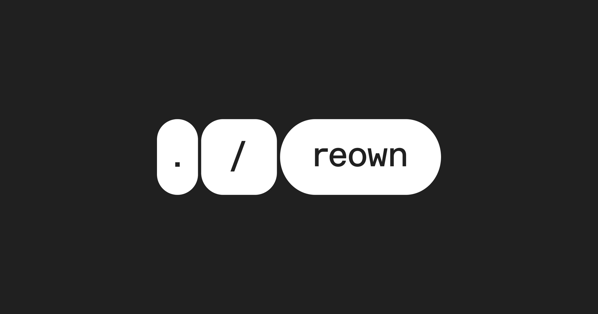
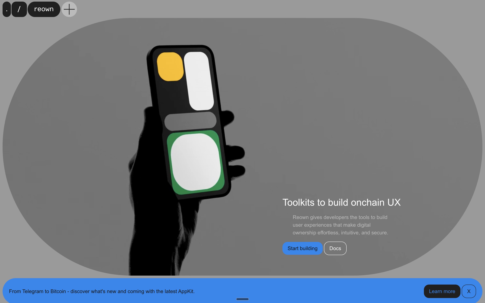
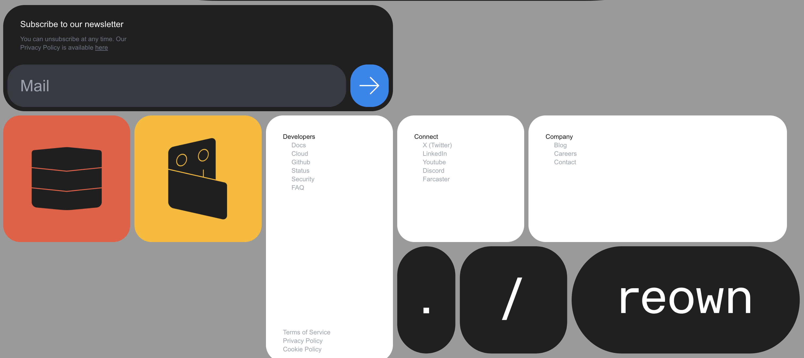

# Reown Web

[](LICENSE)
[](https://your-build-url)
[](CONTRIBUTING.md)

## 🚀 Reown Homepage Clone



### Description

A visually engaging and informative homepage for the Reown website.

### Features

- Dynamic grid layout
- Sticky animated navigation
- Infinite loop carousel

---

## 📸 Screenshots

> A few visual examples of the Reown homepage:

### Hero Section


_An example of the Hero section with the dynamic grid layout._

### Footer Section


_A sneak peek of the footer section with sticky navigation._

---

## 🛠️ Installation

### Prerequisites

Ensure you have the following installed on your machine:

- **[Node.js](https://nodejs.org/)**: v14.x or higher
- **[npm](https://www.npmjs.com/)**: v6.x or higher (or `yarn` if you prefer)

### Dependencies

Run `npm install` to install these dependencies:

- **[class-variance-authority](https://www.npmjs.com/package/class-variance-authority)**: v0.7.0 – Manages variant classes for styling
- **[clsx](https://www.npmjs.com/package/clsx)**: v2.1.1 – Utility for conditionally joining class names
- **[next](https://www.npmjs.com/package/next)**: v15.0.3 – React framework for server-rendered applications
- **[react](https://www.npmjs.com/package/react)**: v19.0.0 (release candidate) – Library for building UI components
- **[react-dom](https://www.npmjs.com/package/react-dom)**: v19.0.0 (release candidate) – React's DOM manipulation library
- **[sass](https://www.npmjs.com/package/sass)**: v1.80.6 – CSS preprocessor for styling with SCSS
- **[swiper](https://www.npmjs.com/package/swiper)**: v11.1.14 – Swiper library for touch sliders

### Dev Dependencies

These are tools used during development:

- **[@types/node](https://www.npmjs.com/package/@types/node)**: TypeScript types for Node.js
- **[@types/react](https://www.npmjs.com/package/@types/react)** and **[@types/react-dom](https://www.npmjs.com/package/@types/react-dom)**: TypeScript types for React
- **[eslint](https://www.npmjs.com/package/eslint)**: v8.x – Linter to ensure code quality
- **[eslint-config-next](https://www.npmjs.com/package/eslint-config-next)**: Next.js-specific ESLint configuration
- **[postcss](https://www.npmjs.com/package/postcss)**: v8.x – CSS processing library used with Tailwind CSS
- **[tailwindcss](https://www.npmjs.com/package/tailwindcss)**: v3.4.1 – Utility-first CSS framework for styling
- **[typescript](https://www.npmjs.com/package/typescript)**: v5.x – Superset of JavaScript adding static typing

### Steps to Install

```bash
# Clone this repository
git clone https://github.com/username/project-name.git

# Navigate to the project directory
cd project-name

# Install dependencies
npm install

# Run the application
npm start
```
